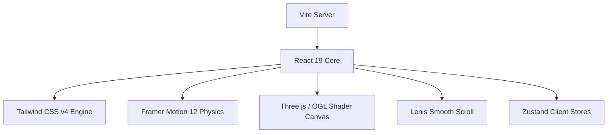

# ✨ Manan Shah — B.Tech IT & Applied AI/ML Portfolio

[](https://react.dev/)
[](https://vitejs.dev/)
[](https://tailwindcss.com/)
[](https://www.framer.com/motion/)
[](https://threejs.org/)

An institutional-grade, highly interactive developer portfolio and applied AI showcase built for **Manan Shah**—a research-focused final-year B.Tech IT Engineer at **Dwarkadas J. Sanghvi College of Engineering (DJSCE) Mumbai**. 

This portfolio acts as a highly customized command center, combining immersive sensory design with functional engineering metrics, high-fidelity spatial motion, and deep analytics.

---

## ⚡ Immersive UI/UX Features

The frontend portfolio application is designed around premium, restrained aesthetics and tactile micro-interactions that elevate it beyond static websites:

### 1. 🎬 Cinematic Opener with Web Audio Synthesis
- **WebGL Nodes:** An active background node canvas tracing real-time physics and mouse-proximity connections.
- **Audio Synthesizer:** Incorporates an native browser `AudioContext` web-synthesizer generating a deep sub-bass impact chord, high-tech metallic pads, and dynamic digital scan pings synchronized precisely with high-contrast text reveals.
- **Auto-Dismiss:** A 4.8s cinematic introductory sequence that automatically slides into the primary interface, bypassable via direct spatial clicks.

### 2. 📊 Interactive Developer Dashboard Widget
- **Cursor Repulsion:** 4 floating metrics cards (Projects, Experience, Research, AI Focus) that physically repel and float dynamically away from the cursor path, utilizing complex vector mechanics and Framer Motion spring layouts.
- **Simulated Terminal Stream:** A live, recursive typewriter status console executing terminal lines tracking system attributes, streak calendars (840+ days built), and git commit velocities.

### 3. ⛵ Navigation & Spatial Restraint
- **macOS-Inspired Dock:** A responsive dock nav component featuring fluid magnification transforms, spring-based hovering offsets, and customized Lucide-react interface nodes.
- **Dynamic Island TOC:** A floating table of contents tracker simulating modern mobile device interfaces, auto-highlighting section transitions using custom Intersection Observer hooks.
- **Custom Cursor & Smooth Scroll:** Integrated Lenis scroll library rendering momentum scrolling alongside a custom-rendered ring cursor that reacts, inflates, and shifts colors depending on interactive target states.

---

## 🛠️ Architecture & Tech Stack



### Core Technologies
- **Framework:** React 19.2 (Functional Components & Hooks)
- **Tooling:** Vite 7.3 + TypeScript 5.9
- **Styles:** Tailwind CSS v4.0 (utilizing advanced custom HSL color systems, CSS variable properties, and dark mode hooks)
- **Physics & Motion:** Framer Motion 12.3 + WebGL/OGL particle fields
- **Scroll Engine:** Lenis Scroll 1.3
- **State Management:** React Context + Zustand for component state distribution

---

## 📂 Project Structure

```
manan-portfolio/
├── dist/                     # Optimized production bundle outputs
├── public/                   # Asset maps and global icons
├── src/
│   ├── components/           # UI Components
│   │   ├── ui/               # Core atomic interface components (Dynamic Island, etc.)
│   │   ├── About.tsx         # Deep background, timeline, and domain insights
│   │   ├── CinematicOpener   # System initialization and Web Audio synthesizer
│   │   ├── DeveloperDashboard# Real-time metrics panel with cursor repulsion
│   │   ├── Dock.tsx          # Magnetic interactive macOS-inspired dock
│   │   ├── Particles.tsx     # WebGL/Canvas custom vector particle field
│   │   ├── Projects.tsx      # Comprehensive project portfolio directory
│   │   ├── Skills.tsx        # Structured developer toolkit matrices
│   │   └── ...
│   ├── contexts/             # Global Theme and system environment state
│   ├── hooks/                # Custom hooks (Mobile detection, viewport tracking)
│   ├── lib/                  # External integrations and UI helper utilities
│   ├── main.tsx              # React mounting root
│   ├── index.css             # Core CSS variables, glassmorphism design tokens
│   └── App.tsx               # Orchestration layer and layout section dividers
├── package.json              # Script configurations and strict dependencies
├── tsconfig.json             # Compiler options for type-safe static checking
└── vite.config.ts            # Fast refresh & bundling configuration pipeline
```

---

## 🚀 Showcased Engineering Portfolio

The portfolio highlights six of Manan's leading projects in applied machine learning, quant finance, and natural language processing:

| Project | Summary | Key Tech Stack |
| :--- | :--- | :--- |
| **🏛️ RiskMatrix** | Multi-asset portfolio risk dashboard computing rolling volatility, Max Drawdowns, Sharpe ratios, and Pearson correlation matrices on live market tickers. | Next.js 14, FastAPI, PostgreSQL, Supabase, SQLAlchemy, Pandas, NumPy, Recharts |
| **🔍 Financial Lens** | Stress-testing, rolling correlation, and OLS regression engines evaluating portfolio sensitivities under historical market crash scenarios. | Next.js, FastAPI, Python, Pandas, Statsmodels, Finnhub, Recharts, TailwindCSS |
| **🤖 StockIntel** | Financial intelligence platform parsing technical indicators, valuation metrics, and media sentiment indexes for stock evaluations. | Next.js, TypeScript, FastAPI, PostgreSQL, NeonDB, NextAuth, TailwindCSS |
| **🛡️ DeepGuard** | Research-driven deepfake detection model optimized on 12k+ Indian media samples using facial landmark analysis and frequency-domain signal processing. | Python, PyTorch, OpenCV, TensorFlow, FastAPI, React |
| **📄 InsureDoc v2** | Transformer-based OCR pipeline parsing scanned heterogeneous PDFs and extracting policy schemas with fine-tuned BERT classifiers. | Python, FastAPI, Transformers, BERT, Tesseract, Streamlit, PostgreSQL |
| **🔎 FinSearch** | Financial PDF semantic search engine utilizing dense vector similarity matching hybridized with sparse BM25 retrieval heuristics. | Python, FastAPI, VectorDB, Sentence-Transformers, React, TailwindCSS |

---

## 🎨 Design System & Core Typography

The portfolio enforces a curated, high-contrast typography system designed for spatial readability:
- **Headlines & Accents:** `Instrument Serif` (Italic, weight 400)—providing editorial, premium literary elegance.
- **Interface & Content:** `Plus Jakarta Sans` / `DM Sans`—delivering high legibility across compact grid layouts.
- **Numbers & Consoles:** `JetBrains Mono` / `IBM Plex Mono`—for clean tabular alignments and digital terminal vibes.

### 🎨 Color Palette & Glassmorphism Tokens
```css
:root {
  --bg: #f9f6f0;               /* Soft, clean linen light background */
  --fg: #1c1a17;               /* Near-black ink typography */
  --accent: #2d6a4f;           /* Forest emerald */
  --secondary: #c45c26;        /* Warm copper */
  --glass-bg: rgba(255, 255, 255, 0.4);
  --glass-border: rgba(0, 0, 0, 0.08);
}

.dark {
  --bg: #07090f;               /* Deep spatial void */
  --fg: #f1f5f9;               /* Slate ice primary typography */
  --accent: #38bdf8;           /* High-frequency neon sky blue */
  --secondary: #a78bfa;        /* Soft financial violet */
  --glass-bg: rgba(15, 23, 42, 0.35);
  --glass-border: rgba(255, 255, 255, 0.08);
}
```

---

## ⚙️ Quick Start & Local Setup

### Prerequisites
- **Node.js 18.0+**
- **npm** or **yarn** package manager

### Steps to Run Locally

1. **Clone the repository:**
   ```bash
   git clone https://github.com/Technova100/manan-portfolio.git
   cd manan-portfolio
   ```

2. **Install project dependencies:**
   ```bash
   npm install
   ```

3. **Configure Environment Variables (Optional):**
   Create a `.env` or `.env.local` file in the root directory if any custom analytics keys or database interfaces are integrated.

4. **Spin up the local Vite development server:**
   ```bash
   npm run dev
   ```

5. **Open in browser:**
   Navigate to [http://localhost:5173](http://localhost:5173) in your local web browser.

---

## 🎖️ Professional Domain Certifications
Beyond core programming competencies, the portfolio showcases verified competencies in quantitative finance and advanced theoretical ML:
- 🏛️ **AMFI Certification** — Association of Mutual Funds in India (Mutual Funds & Wealth Advisory)
- 🛡️ **NISM Series V-A** — National Institute of Securities Markets (Mutual Fund Distributors)
- 🧠 **Machine Learning Specialization** — Stanford Online & DeepLearning.AI
- 🤖 **Getting Started with AI on Jetson Nano** — NVIDIA
- 🎓 **McKinsey Forward Program** — McKinsey & Company (Structured Problem Solving & Leadership)
